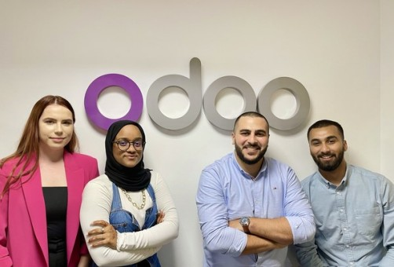

# User Personas

<!-- some introduction -->

Listed below are focus groups that will find the program interesting and will
benefit from collaboration and interaction.

<!-- a persona -->

## Their Role

---

### Student

- **Bio**: Alex is 28 and wants to gain new knowledge in programming and change
  his profession.
- **Needs/Goals**: He must be passionate about his idea and want to develop in
  the field of acquiring new knowledge.
- **Frustrations**: Perseverance and perseverance are required. Specialized
  terminological jargon.
- **Scenario 1**: After successfully completing the training and gaining
  knowledge and skills, Alex has the opportunity to find a job as a programmer.

---

### Volunteers-teachers

- **Bio**: Sofia has a pedagogical education and programming knowledge and wants
  to help other people gain new knowledge in programming.
- **Needs/Goals**: She must be passionate about her idea and be adaptable to
  working with students.
- **Frustrations**: The diversity of students can create certain difficulties in
  organizing the learning process.
- **Scenario 1**: Improving skills in preparing and presenting educational
  materials, as well as obtaining positive results from student success.

---

### Sponsors and employers

- **Bio**: The odoo company needs new programmers and in cooperation with us we
  want to promote the learning process.
- **Needs/Goals**: They are interested in tailoring the training program to
  in-depth study of the technologies and frameworks that are used to develop
  their product..
- **Frustrations**: The students' initial level of training may not be
  sufficient for integration into the company's development team.
- **Scenario 1**: The most successful students can get a job in the company..

---
